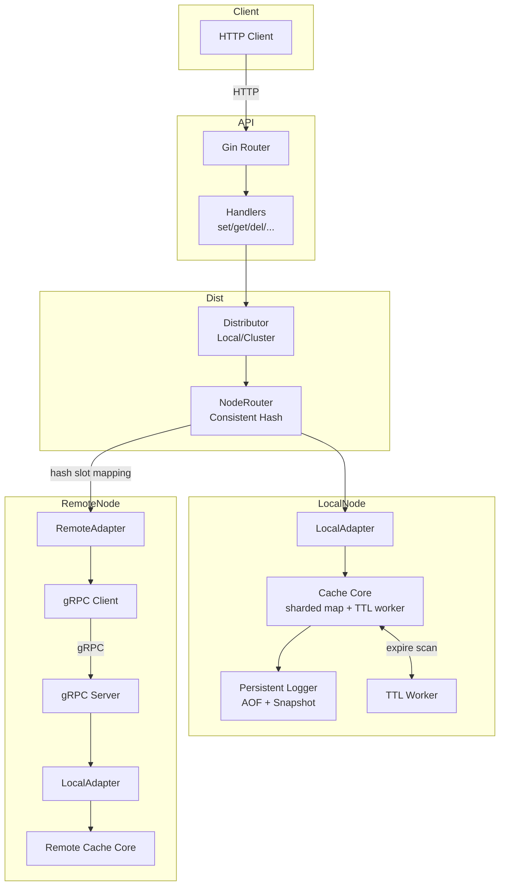

# go-cache-server-mini
[한국어 README](README.md)

## Overview
`go-cache-server-mini` is a lightweight in-memory cache server that exposes Redis-like primitives through a small Gin-based HTTP API. It is purpose-built for workshops, demos, and integration tests that need a disposable stateful endpoint without external dependencies, and can optionally replicate the same operations across nodes via gRPC in distributed mode.

## What's New
- **Sharded cache core**: Keys are distributed across 256 shards using FNV hashing, and each shard has its own RWMutex. `MGet/MSet` lock each shard only once to keep critical sections small.
- **Sampled expiration worker**: Every second a background worker samples up to 20 keys from random shards to evict expired entries, keeping the cleanup cost bounded even with many keys.
- **Optional file persistence**: With `persistent.type: file`, the server keeps an append-only log (`cache.aof`) and snapshots (`cache.snap`) under `persistent_data`. Startup loads the snapshot first and replays the AOF; shutdown closes channels so pending flushes complete.
- **Snapshot/AOF strategy**: Snapshots fire every 60s, pausing AOF writes while a temp file swap happens. The AOF batches writes (every 100ms or 1000 commands) before hitting disk.
- **Built-in metrics**: Prometheus counters/histograms cover HTTP latency/errors, cache hits/misses/key count/expirations, and persistence activity (AOF write count/duration/errors, snapshot write count/duration/errors). Exported at `/metrics`.

## Metrics
The server exposes Prometheus-formatted metrics at the `/metrics` endpoint. Key metrics include:

### HTTP Metrics
- `http_request_total`: Total requests by method, path, and status code.
- `http_request_duration_seconds`: Request latency distribution (Histogram).
- `http_request_errors_total`: Total count of 4xx/5xx errors.

### Cache Metrics
- `cache_hits_total`: Number of successful cache lookups (excluding expired keys).
- `cache_misses_total`: Number of failed lookups (missing or expired keys).
- `cache_key_count`: Current number of keys in the cache (Gauge).
- `cache_expirations_total`: Total number of keys evicted due to expiration.

### Persistence Metrics
- `persistence_aof_write_total`: Total AOF write operations.
- `persistence_aof_write_errors_total`: Total AOF write failures.
- `persistence_aof_write_duration_seconds`: Duration of AOF writes (Histogram).
- `persistence_snapshot_write_total`: Total snapshot creation operations.
- `persistence_snapshot_write_errors_total`: Total snapshot creation failures.
- `persistence_snapshot_write_duration_seconds`: Duration of snapshot creation (Histogram).

## Features
- **Broader endpoint coverage**: Beyond basic `set/get/del`, the server ships with `setnx`, `getset`, `mget`, and `mset` so you can model simple workflows and bulk operations.
- **TTL & persistence**: Missing or zero TTL falls back to the configured default, values above the max TTL are clamped, and negative TTLs mark the key as persistent (reported as `-1`). A background worker evicts expired entries every second.
- **Atomic counters**: `incr`/`decr` mutate integer payloads atomically while maintaining TTL/persistence flags.
- **Concurrency-safe core**: A RWMutex-protected map keeps the implementation simple and predictable, and reusable error values live in `internal/errors.go`.
- **Graceful shutdown**: `cmd/main.go` ties signal handling, the API server, and the expiration worker together to guarantee clean exits.
- **Distributed/replication (optional)**: With `distributed.enabled` set, a gRPC server/client pair plus a consistent-hash `NodeRouter` replicate writes/expire/delete/incr/decr/bulk ops asynchronously to other nodes responsible for the same hash slots, while avoiding overwrites on the local adapter.

## Architecture at a Glance


## API at a Glance
| Method | Path | Body / Query | Description |
| --- | --- | --- | --- |
| GET | `/ping` | - | Health check |
| POST | `/set` | `{"key","value","ttl?"}` | Store a value with TTL in seconds |
| GET | `/get` | `?key=` | Return the JSON payload as-is |
| DELETE | `/del` | `?key=` | Remove a key |
| GET | `/exists` | `?key=` | Boolean existence check |
| GET | `/keys` | - | List current keys |
| POST | `/expire` | `{"key","ttl"}` | Update TTL (≤0 deletes the key) |
| GET | `/ttl` | `?key=` | Remaining TTL in seconds (`-1` for persistent keys) |
| POST | `/persist` | `?key=` | Remove the expiration |
| POST | `/flush` | - | Clear the whole cache |
| POST | `/incr` | `?key=` | Increment an integer value and return it |
| POST | `/decr` | `?key=` | Decrement an integer value and return it |
| POST | `/setnx` | `{"key","value","ttl?"}` | Only set when the key does not exist |
| POST | `/getset` | `{"key","value"}` | Swap the value and return the old payload |
| POST | `/mget` | `{"keys":[]}` | Retrieve multiple keys at once |
| POST | `/mset` | `{"kv":{},"ttl?"}` | Write multiple keys with the same TTL |

### TTL semantics
1. Missing/zero TTL → `ttl.default`.
2. TTL above `ttl.max` → clamped to the configured max.
3. Negative TTL → persistent key (`-1`), unaffected by the expire worker.

### Usage examples
```bash
# Store a value with a 1h TTL
curl -X POST http://localhost:8080/set \
  -H "Content-Type: application/json" \
  -d '{"key":"greeting","value":"\"hello\"","ttl":3600}'

# Bulk write & read
curl -X POST http://localhost:8080/mset \
  -H "Content-Type: application/json" \
  -d '{"kv":{"foo":1,"bar":2}}'
curl -X POST http://localhost:8080/mget \
  -H "Content-Type: application/json" \
  -d '{"keys":["foo","bar"]}'

# Increment a counter
curl -X POST "http://localhost:8080/incr?key=counter"
```
Values are stored as `json.RawMessage`, so any valid JSON document (string, object, number, etc.) is preserved byte-for-byte.

## Project Layout
```
cmd/main.go                  # Entry point, signal handling, graceful shutdown
internal/api/api.go          # Gin bootstrap + router wiring
internal/api/handler/*.go    # HTTP handlers per endpoint
internal/api/dto/*.go        # Request/response DTOs
internal/core/core.go        # Cache implementation, TTL worker, bulk/numeric ops
internal/core/cache_interface.go
internal/util/convert.go     # TTL normalization + int/[]byte helpers
internal/config/config.go    # YAML loader (supports env interpolation)
internal/errors.go           # Shared error values
config.yml                   # Default TTL + HTTP binding
```

## Quickstart
1. Install Go 1.24.5 or newer.
2. Run the server:
   ```bash
   go run ./cmd
   ```
3. Build a binary when needed:
   ```bash
   go build -o bin/cache-server ./cmd
   ```

## Configuration
Edit `config.yml` and optionally embed environment variables such as `${PORT}`—they are expanded via `os.ExpandEnv` at load time.

```yaml
persistent:
  type: file          # options: memory, file
ttl:
  default: 86400   # fallback TTL when omitted
  max: 604800      # clamp overly large TTLs
http:
  enabled: true
  address: ":8080"
distributed:
  enabled: false
  grpc_port: 50051
  swarm_service_name: "go-cache-service"  # DNS lookup to discover peers
  update_interval: 10                     # seconds between ring refresh
  replication_factor: 3                   # virtual nodes per physical node
  backup_nodes: 0                         # extra replicas beyond primary
```

## Graceful shutdown & error propagation
- `cmd/main.go` listens for `SIGINT`/`SIGTERM`, cancels the shared context, and waits for the API goroutine and expiration worker before exiting.
- `api.StartAPIServer` surfaces bind failures (e.g., port already in use) so the process logs the error and exits with status code `1` instead of leaving background goroutines running.
- In distributed mode the gRPC server shuts down alongside the API, and the ring membership is refreshed periodically via DNS (`swarm_service_name`).

## Distributed mode summary
- `internal/distributed/router/node_router.go`: builds the consistent-hash ring, selects primary/backup adapters per key, and refreshes ring membership by re-resolving DNS.
- `internal/distributed/adapter/local_adapter.go` / `remote_adapter.go`: wrap the local core and gRPC client behind the same interface.
- `internal/distributed/router/distributor.go`: applies writes/expiry/delete/counters/bulk ops locally then replicates asynchronously to non-local adapters (using `context.WithoutCancel`); reads fall back to mapped adapters when local cache misses.
- `cmd/main.go`: only opens the gRPC server and wires the API to the clustered distributor when `distributed.enabled=true`.

## Development & Testing
- Run the full suite: `go test ./...`
- If macOS blocks `$HOME/Library/Caches/go-build`, pin the build cache locally:
  ```bash
  mkdir -p .gocache
  GOCACHE=$(pwd)/.gocache go test ./...
  ```
- Most endpoint coverage lives in `internal/api/handler/handler_test.go`; extend those table-driven tests when adding new behavior.
- Run multiple instances by editing `http.address` in `config.yml` or injecting an environment variable override.
