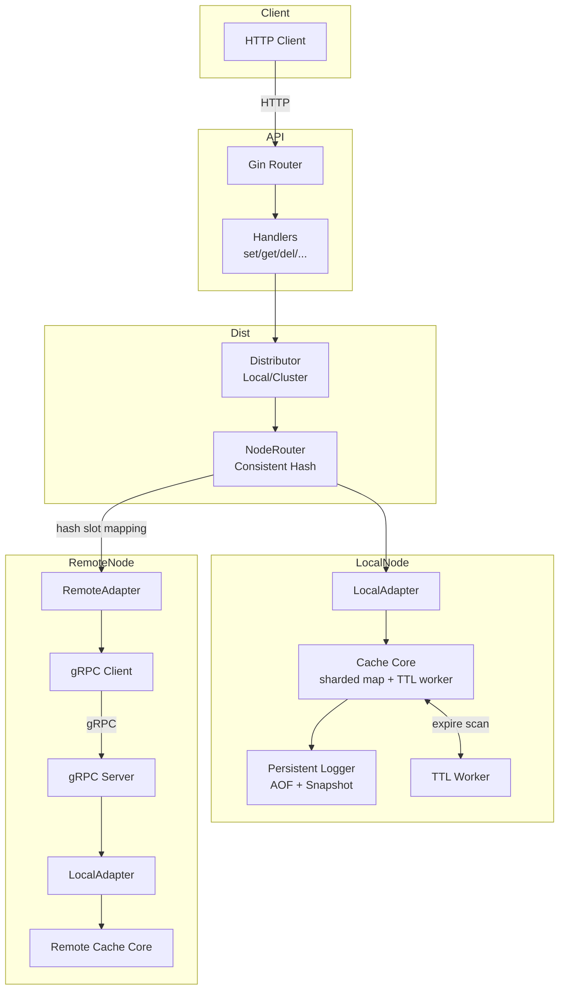

# go-cache-server-mini
[English README](README.en.md)

## 개요
`go-cache-server-mini`는 Gin 기반 HTTP API로 키-값을 읽고 쓰는 초경량 인메모리 캐시 서버입니다. 학습·실험·간단한 통합 테스트에서 상태를 빠르게 저장할 수 있도록 설계되었으며, TTL·숫자 연산·벌크 작업 등 Redis에서 자주 쓰는 최소 기능을 제공합니다. 필요 시 gRPC를 통해 노드 간에 동일 연산을 전파하는 분산 모드를 켤 수 있습니다.

## 변경/추가 사항
- **샤딩된 캐시 코어**: FNV 해시로 256개 샤드에 키를 분산하고 샤드별 RWMutex를 잡아 동시성 경쟁을 줄였습니다. `MGet/MSet`은 중복 샤드를 한 번만 잠가 배타 구간을 최소화합니다.
- **만료 워커 샘플링**: 1초마다 무작위 샤드에서 최대 20개 키만 검사·삭제하는 샘플링 방식을 사용해 큰 키 공간에서도 워커 부하를 제한합니다.
- **파일 영속화 옵션**: `persistent.type: file`이면 `persistent_data` 이하에 AOF(`cache.aof`)와 스냅샷(`cache.snap`)을 유지합니다. 시작 시 스냅샷을 먼저 불러오고 AOF로 리플레이하며, 종료 시 채널을 닫아 질서 있게 flush 합니다.
- **스냅샷/로그 처리 방식**: 스냅샷은 60초마다 트리거되어 AOF를 `PAUSE`/`RESUME`하며 temp 파일을 교체합니다. AOF는 100ms 배치 또는 1000건 버퍼 기준으로 디스크에 기록합니다.
- **프로메테우스 메트릭**: `/metrics` 엔드포인트로 HTTP 지표(지연/오류), 캐시 지표(히트/미스/키 수/만료 건수), 영속화 지표(AOF 쓰기 건수/지연/에러, 스냅샷 쓰기 건수/지연/에러)를 노출합니다.

## 메트릭 (Metrics)
서버는 Prometheus 포맷의 메트릭을 `/metrics` 엔드포인트에서 제공합니다. 주요 지표는 다음과 같습니다.

### HTTP 지표
- `http_request_total`: 메서드, 경로, 상태 코드별 요청 수
- `http_request_duration_seconds`: 요청 처리 시간 분포 (Histogram)
- `http_request_errors_total`: 4xx/5xx 에러 발생 수

### 캐시 지표
- `cache_hits_total`: 캐시 적중 횟수 (만료된 키 제외)
- `cache_misses_total`: 캐시 미스 횟수 (없는 키 + 만료된 키)
- `cache_key_count`: 현재 저장된 키의 총 개수 (Gauge)
- `cache_expirations_total`: 만료되어 삭제된 키의 총 개수

### 영속화 지표 (Persistence)
- `persistence_aof_write_total`: AOF 파일 쓰기 횟수
- `persistence_aof_write_errors_total`: AOF 쓰기 실패 횟수
- `persistence_aof_write_duration_seconds`: AOF 쓰기 소요 시간 (Histogram)
- `persistence_snapshot_write_total`: 스냅샷 생성 횟수
- `persistence_snapshot_write_errors_total`: 스냅샷 생성 실패 횟수
- `persistence_snapshot_write_duration_seconds`: 스냅샷 생성 소요 시간 (Histogram)

## 주요 기능
- **확장된 엔드포인트**: 단건(`set`, `get`, `del`)뿐 아니라 `setnx`, `getset`, `mget`, `mset`과 같은 멱등·벌크 연산까지 제공해 테스트 시나리오를 유연하게 구성할 수 있습니다.
- **TTL & 영구 키**: TTL을 생략하면 기본 TTL을 사용하고, 음수를 넣으면 `persist` 상태(-1 TTL)로 저장됩니다. 만료 워커가 1초 간격으로 캐시를 스캔합니다.
- **숫자 연산**: `incr`, `decr`가 문자열로 저장된 정수 값을 원자적으로 갱신합니다.
- **동시성 안전**: RWMutex로 보호된 맵과 중앙 집중 에러(`internal/errors.go`)를 사용해 단순하면서도 예측 가능한 동작을 유지합니다.
- **Graceful shutdown**: `cmd/main.go`가 SIGINT/SIGTERM을 받아 API 서버와 만료 워커를 순차 종료합니다.
- **분산/복제 지원(옵션)**: `distributed.enabled`를 켜면 gRPC 서버/클라이언트가 떠서, Consistent Hash 기반 라우터(`NodeRouter`)가 동일 키 해시 슬롯의 다른 노드들에 쓰기·만료·삭제·증감·벌크 연산을 비동기로 복제합니다. 로컬 샤드의 값을 덮지 않도록 로컬 어댑터는 복제 대상에서 제외합니다.

## 아키텍처 개요


## API 한눈에 보기
| Method | Path | Body / Query | 설명 |
| --- | --- | --- | --- |
| GET | `/ping` | - | Liveness/Health 체크 |
| POST | `/set` | `{"key","value","ttl?"}` | 값을 저장, TTL은 초 단위 |
| GET | `/get` | `?key=` | 값을 JSON 그대로 반환 |
| DELETE | `/del` | `?key=` | 키 삭제 |
| GET | `/exists` | `?key=` | 존재 여부(boolean) |
| GET | `/keys` | - | 현재 키 목록 |
| POST | `/expire` | `{"key","ttl"}` | TTL 재설정, 0 이하이면 삭제 |
| GET | `/ttl` | `?key=` | 남은 TTL(초). 영구 키는 -1 |
| POST | `/persist` | `?key=` | 만료 시간을 제거 |
| POST | `/flush` | - | 모든 키 제거 |
| POST | `/incr` | `?key=` | 정수 값 +1 후 값 반환 |
| POST | `/decr` | `?key=` | 정수 값 -1 후 값 반환 |
| POST | `/setnx` | `{"key","value","ttl?"}` | 키가 없을 때만 저장 |
| POST | `/getset` | `{"key","value"}` | 새 값으로 교체하고 이전 값을 반환 |
| POST | `/mget` | `{"keys":[]}` | 여러 키를 한 번에 조회 |
| POST | `/mset` | `{"kv":{},"ttl?"}` | 여러 키를 동일 TTL로 저장 |

### TTL 규칙
1. `ttl`이 0이거나 누락되면 `config.yml`의 `ttl.default`를 사용합니다.
2. `ttl`이 `ttl.max`를 넘으면 자동으로 잘립니다.
3. `ttl`에 음수를 주면 `persist` 상태(-1)로 저장되며 만료 워커의 대상에서 제외됩니다.

### 요청 예시
```bash
# 1시간 TTL로 저장
curl -X POST http://localhost:8080/set \
  -H "Content-Type: application/json" \
  -d '{"key":"greeting","value":"\"hello\"","ttl":3600}'

# 벌크 저장 후 조회
curl -X POST http://localhost:8080/mset \
  -H "Content-Type: application/json" \
  -d '{"kv":{"foo":1,"bar":2}}'
curl -X POST http://localhost:8080/mget \
  -H "Content-Type: application/json" \
  -d '{"keys":["foo","bar"]}'

# 숫자 연산
curl -X POST "http://localhost:8080/incr?key=counter"
```
`value`는 `json.RawMessage`로 저장되므로 문자열, 객체, 숫자 등 어떤 JSON 타입도 변형 없이 round-trip 됩니다.

## 프로젝트 구조
```
cmd/main.go                  # 엔트리포인트, 시그널 처리, graceful shutdown
internal/api/api.go          # Gin 서버 부트스트랩 및 라우트 매핑
internal/api/handler/*.go    # 각 HTTP 엔드포인트 구현
internal/api/dto/*.go        # 요청/응답 DTO
internal/core/core.go        # 캐시 구현, TTL/만료 워커, 숫자/벌크 연산
internal/core/cache_interface.go
internal/util/convert.go     # TTL 정규화, int<->[]byte 변환
internal/config/config.go    # YAML 설정 로더 (env 확장 지원)
internal/errors.go           # 공용 에러 정의
config.yml                   # 기본 TTL, HTTP 바인딩 등 런타임 설정
```

## 빠른 시작
1. Go 1.24.5 이상을 설치합니다.
2. 서버 실행:
   ```bash
   go run ./cmd
   ```
3. 배포용 바이너리 생성:
   ```bash
   go build -o bin/cache-server ./cmd
   ```

## 설정
`config.yml`을 수정하거나 `${PORT}`처럼 환경 변수를 넣어두면 런타임에 `os.ExpandEnv`로 치환됩니다.

```yaml
persistent:
  type: file          # 옵션: memory, file
ttl:
  default: 86400      # TTL 미지정 시 1일
  max: 604800         # TTL 상한 7일
http:
  enabled: true
  address: ":8080"
distributed:
  enabled: false
  grpc_port: 50051
  swarm_service_name: "go-cache-service"  # DNS로 다른 노드 IP를 조회
  update_interval: 10                     # 초 단위, 리모트 노드 목록 재수집 주기
  replication_factor: 3                   # Consistent Hash 링에 넣을 가상 노드 수
  backup_nodes: 0                         # 주 노드 외 추가 백업 노드 수
```

## Graceful shutdown & 오류 전파
- `cmd/main.go`가 SIGINT/SIGTERM을 수신하면 컨텍스트를 취소하고 API 서버 · TTL 워커를 기다린 후 종료합니다.
- `api.StartAPIServer`가 포트를 잡지 못하면 즉시 에러를 반환하고, 메인은 에러 로그를 남긴 뒤 종료 코드 1로 프로세스를 종료합니다.
- 분산 모드에서는 gRPC 서버도 함께 종료되며, 링 정보는 DNS(`swarm_service_name`) 재조회로 주기적으로 갱신됩니다.

## 분산 모드 동작 요약
- `internal/distributed/router/node_router.go`: Consistent Hash 링 구성, 복제본/백업 노드 개수에 맞춰 키별 대상 어댑터 선정, DNS 재조회로 동적으로 링 갱신.
- `internal/distributed/adapter/local_adapter.go` / `remote_adapter.go`: 로컬 코어와 gRPC 클라이언트를 동일 인터페이스로 감싸 동일 코드로 호출.
- `internal/distributed/router/distributor.go`: 모든 쓰기·만료·삭제·증감·벌크 연산을 로컬에 먼저 적용 후 다른 노드에 비동기 복제(컨텍스트 취소 무시), 조회는 로컬 미스 시 대상 어댑터로 폴백.
- `cmd/main.go`: `distributed.enabled=true`일 때만 gRPC 서버를 열고, API는 분산 디스트리뷰터를 사용하도록 배선.

## 개발 및 테스트
- 단위 테스트: `go test ./...`
- macOS 등에서 `$HOME/Library/Caches/go-build` 접근이 막히면:
  ```bash
  mkdir -p .gocache
  GOCACHE=$(pwd)/.gocache go test ./...
  ```
- `internal/api/handler/handler_test.go`가 엔드포인트 대부분을 커버하므로 신규 기능 추가 시 여기에 케이스를 확장해주세요.
- 여러 인스턴스를 띄워야 한다면 `config.yml`의 `http.address`를 바꾸거나 환경 변수를 주입해 포트를 조정하세요.
